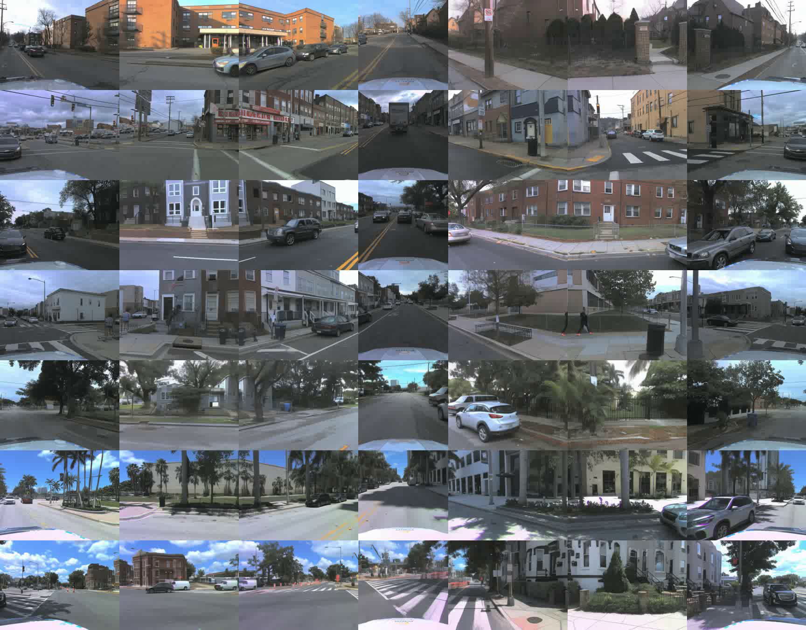
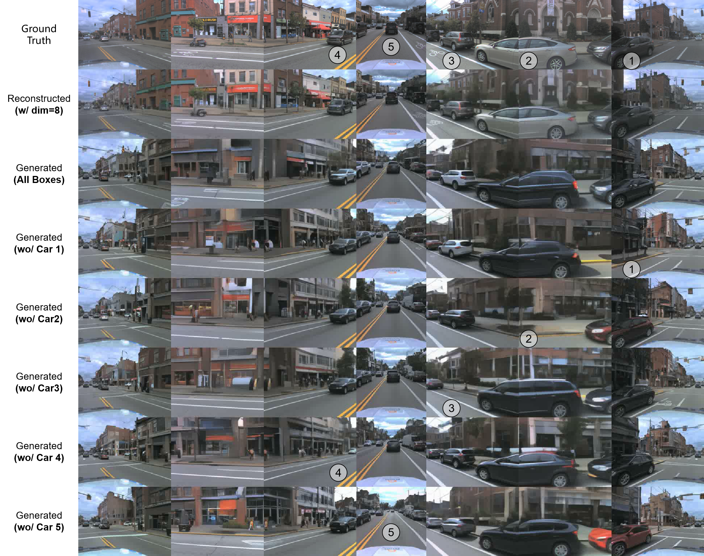
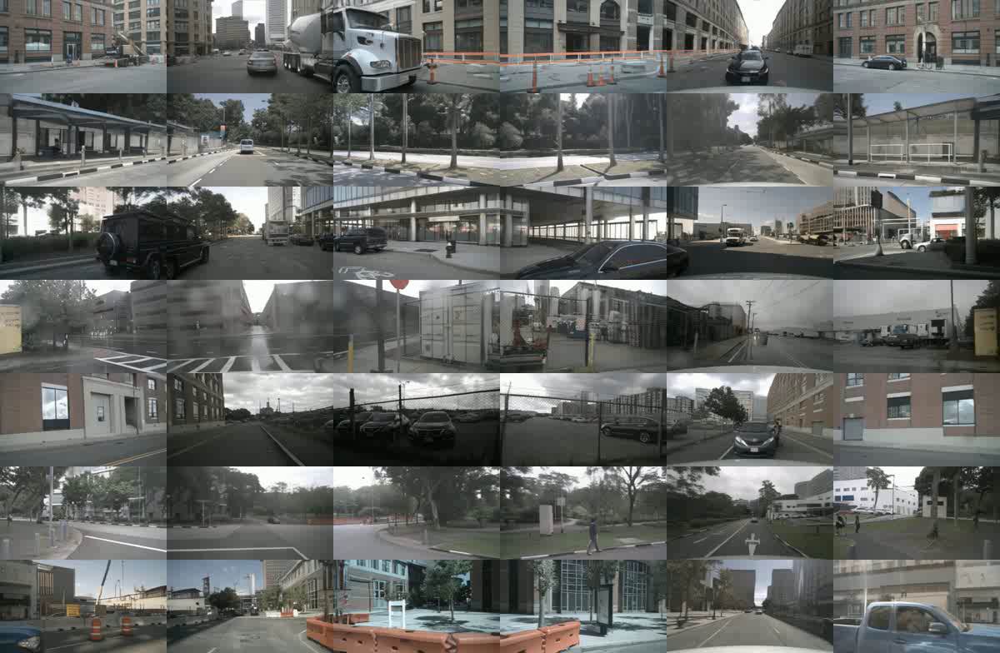
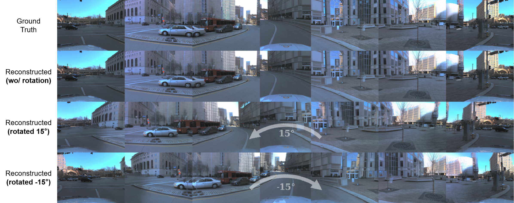
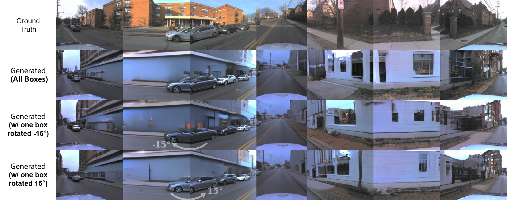
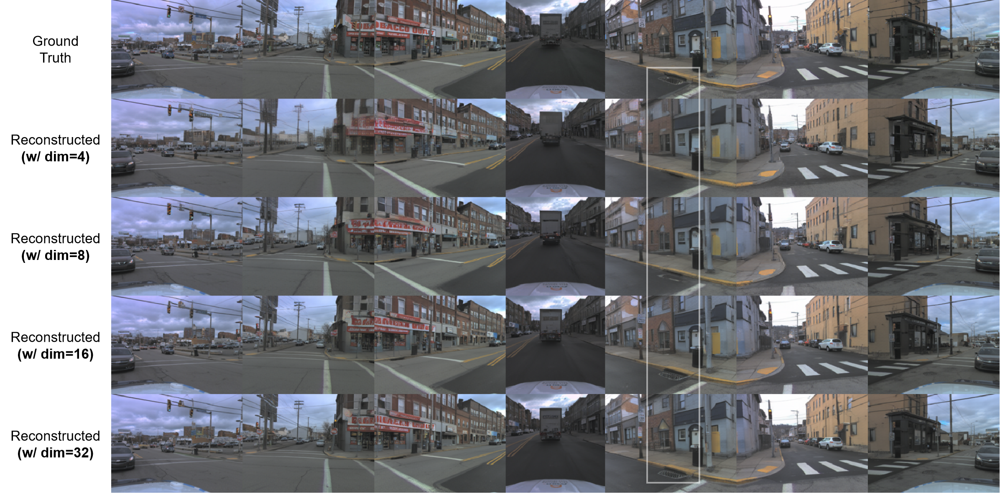

# BEV-VAE: Multi-view Image Generation with Spatial Consistency for Autonomous Driving
[Zeming Chen](https://scholar.google.com/citations?hl=zh-CN&user=u_KlPbgAAAAJ), [Hang Zhao](https://scholar.google.com/citations?hl=zh-CN&user=DmahiOYAAAAJ).
## Abstract

<b>TL; DR</b> BEV-VAE w/ DiT generates multi-view images with spatial consistency in BEV latent space, following the scale law.

Multi-view image generation in autonomous driving demands consistent 3D scene understanding across camera views. 
Most existing methods treat this problem as a 2D image set generation task, lacking explicit 3D modeling. 
However, we argue that a structured representation is crucial for scene generation, especially for autonomous driving applications. 
This paper proposes BEV-VAE for consistent and controllable view synthesis. BEV-VAE first trains a multiview image variational autoencoder for a compact and unified BEV latent space and then generates the scene with a latent diffusion transformer. BEV-VAE supports arbitrary view generation given camera configurations, and optionally 3D layouts.
Experiments on nuScenes and Argoverse 2 (AV2) show strong performance in both 3D consistent reconstruction and generation.

## Method

<b>Overall architecture of BEV-VAE with DiT for multi-view image generation.</b> In Stage 1, BEV-VAE learns to encode multi-view images into a spatially compact latent space in BEV and reconstruct them, ensuring spatial consistency. In Stage 2, DiT is trained with Classifier-Free Guidance (CFG) in this latent space to generate BEV representations from random noise, which are then decoded into multi-view images.
## Performence
:star2: <b>BEV-VAE w/ DiT</b> supports viewing reconstructed or generated driving scenes from different perspectives! 
### Reconstruction on AV2
The AV2 dataset consists of <b>7</b> cameras, with the front camera rotated by 90°. To simplify visualization, the top part of the front view is cropped.
You can <b>click on the image below</b> to watch the video showing the ego view rotated 15° to the left and right.

### Generation on AV2
<b>Row 1</b> shows real images from the validation set, <b>Row 2</b> shows the corresponding reconstructed images, <b>Row 3</b> shows images generated from the same 3D bounding boxes, and <b>each row after that</b> shows generated images after removing a specific vehicle, with <b>the removed vehicles indicated by numerical labels.</b>
<b>Notice:</b> The same 3D bounding box may produce different objects across different generated images.
You can <b>click on the image below</b> to watch the video showing the ego view rotated 15° to the left and right.

### Reconstruction on nuScenes
The nuScenes dataset consists of <b>6</b> cameras, demonstrating that BEV-VAE can support autonomous driving data with different numbers of cameras — as long as the views together cover 360°.
You can <b>click on the image below</b> to watch the video showing the ego view rotated 15° to the left and right.

### Generation on nuScenes
<b>Row 1</b> shows real images from the validation set, <b>Row 2</b> shows the corresponding reconstructed images, <b>Row 3</b> shows images generated from the same 3D bounding boxes, and <b>each row after that</b> shows generated images after removing a specific vehicle, with <b>the removed vehicles indicated by numerical labels.</b>
<b>Notice:</b> The same 3D bounding box may produce different objects across different generated images.
You can <b>click on the image below</b> to watch the video showing the ego view rotated 15° to the left and right.

### Rotating Camera Extrinsics to Render New Views on AV2
<b>Row 1</b> presents validation images, and <b>Row 2</b> shows reconstructions. <b>Rows 3 and 4</b> display reconstructed images with all cameras rotated 15° left and 15° right, respectively.

### Rotating the Orientation of a Specific Vehicle on AV2
<b>Row 1</b> presents validation images, and <b>Row 2</b> shows generated images. <b>Rows 3 and 4</b> depict the same vehicle rotated 15° clockwise and counterclockwise on the ego vehicle's horizontal plane.

###  Reconstruction across Different Latent Dimensions on AV2
<b>Row 1</b> shows images from the validation set, while <b>Rows 2-5</b> display BEV-VAE reconstructions with latent dimensions of 4, 8, 16, and 32. With higher latent dimensions, the reconstruction more accurately preserves fine details, such as the manhole covers in the white box.

## TODO
- [x] releasing the paper
- [ ] tutorial
- [ ] pretrained weight for stage 1&2
- [ ] inference code 
- [ ] train code