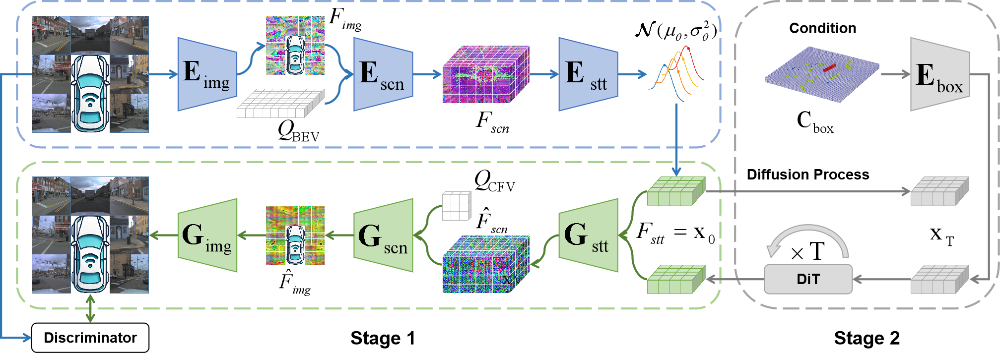
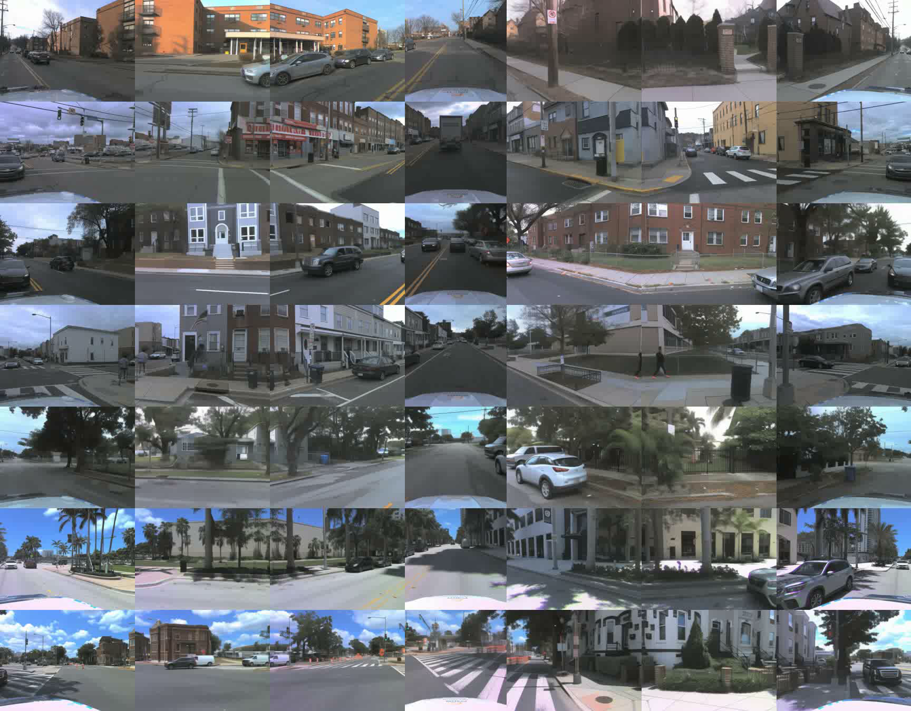
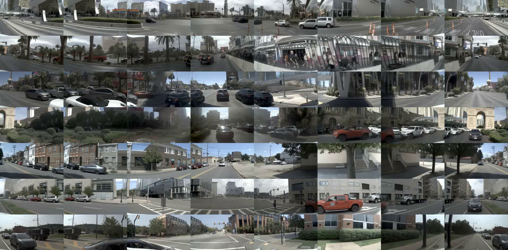
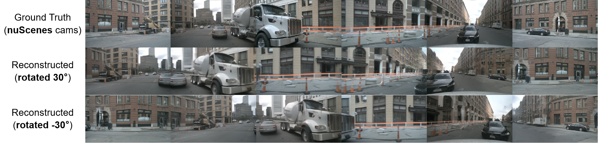
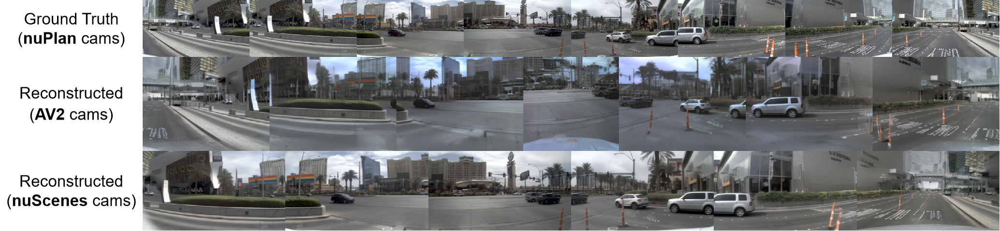
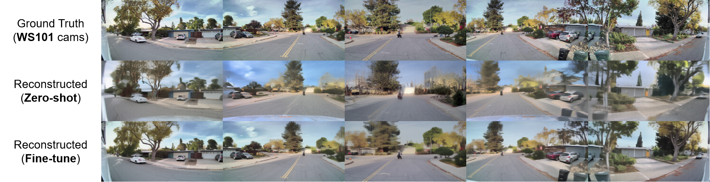
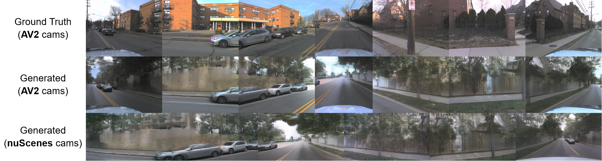
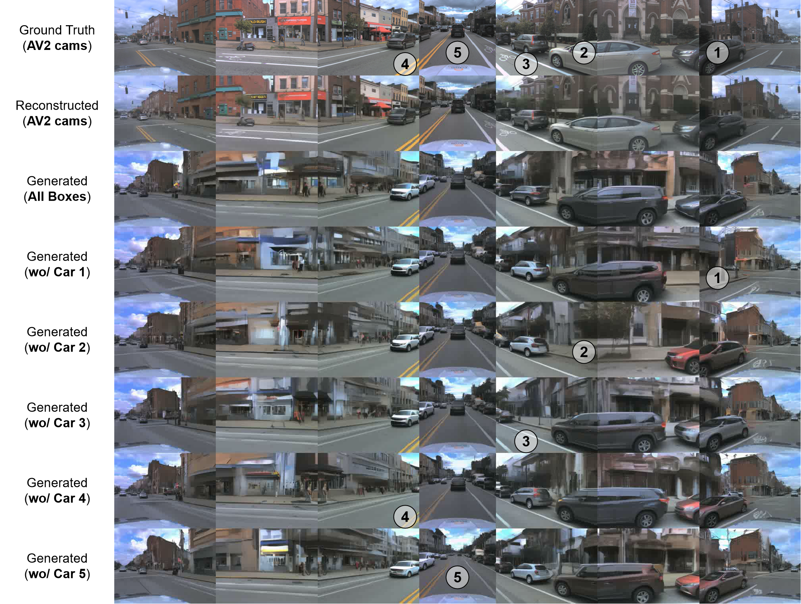
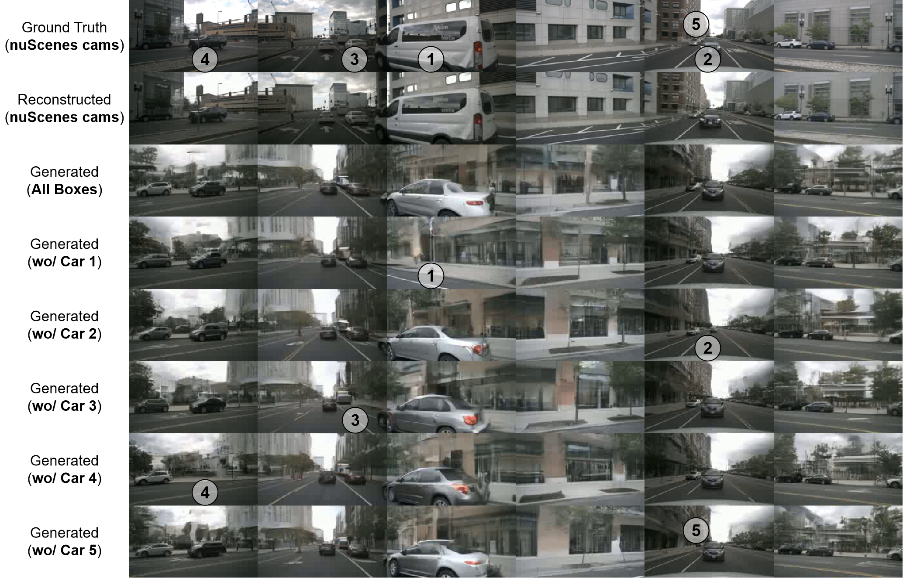

# BEV-VAE: A Unified BEV Representation for Generalizable Driving Scene Synthesis
[Zeming Chen](https://scholar.google.com/citations?hl=zh-CN&user=u_KlPbgAAAAJ), [Hang Zhao](https://scholar.google.com/citations?hl=zh-CN&user=DmahiOYAAAAJ).
## Abstract

<b>TL; DR</b> We introduce BEV-VAE, a variational autoencoder that unifies multi-view images into a BEV representation for generalizable autonomous driving scene synthesis. 

Generative modeling has shown remarkable success in vision and language, inspiring research on synthesizing driving scenes. Existing multi-view synthesis approaches typically operate in image latent spaces with cross-attention to enforce spatial consistency, but they are tightly bound to camera configurations, which limits model generalization. We propose BEV-VAE, a variational autoencoder that learns a unified Bird’s-Eye-View (BEV) representation from multi-view images, enabling encoding from arbitrary camera layouts and decoding to any desired viewpoint. Through multi-view image reconstruction and novel view synthesis, we show that BEV-VAE effectively fuses multi-view information and accurately models spatial structure. This capability allows it to generalize across camera configurations and facilitates scalable training on diverse datasets. Within the latent space of BEV-VAE, a Diffusion Transformer (DiT) generates BEV representations conditioned on 3D object layouts, enabling multi-view image synthesis with enhanced spatial consistency on nuScenes and achieving the first complete seven-view synthesis on AV2. Compared with training generative models in image latent spaces, BEV-VAE achieves superior computational efficiency. Finally, synthesized imagery significantly improves the perception performance of BEVFormer, highlighting the utility of generalizable scene synthesis for autonomous driving.

## Method
### Overall architecture of BEV-VAE with DiT for multi-view image generation.

In Stage 1, BEV-VAE learns to encode multi-view images into a spatially compact latent space in BEV and reconstruct them, ensuring spatial consistency. In Stage 2, DiT is trained with Classifier-Free Guidance (CFG) in this latent space to generate BEV representations from random noise, which are then decoded into multi-view images.

## Experiments

### Datasets
This study uses four multi-camera autonomous driving datasets that differ substantially in scale, camera configuration, annotated categories, and recording locations. Despite these differences, all datasets provide full 360° coverage of the surrounding scene.

| Dataset  | #Frames | #Cameras | #Classes |                    Recording Locations                       |
|:--------:|:-------:|:--------:|:--------:|:------------------------------------------------------------:|
|   WS101  |   17k   |    5     |    0     |               London, San Francisco Bay Area                 | 
| nuScenes |   155k  |    6     |    23    |          Boston, Pittsburgh, Las Vegas, Singapore            | 
|   AV2    |   224k  |    7     |    30    | Austin, Detroit, Miami, Pittsburgh, Palo Alto, Washington DC | 
|  nuPlan  |  3.11M  |    8     |    7     |          Boston, Pittsburgh, Las Vegas, Singapore            | 

We introduce a new hybrid autonomous driving dataset configuration, <b>PAS</b>, which combines nu<b>P</b>lan, <b>A</b>V2, and nu<b>S</b>cenes.

### Multi-view Image Reconstruction
BEV-VAE learns unified BEV representations by reconstructing multi-view images, integrating semantics from all camera views while modeling 3D spatial structure. Reconstruction metrics provide an indirect evaluation of the quality of the learned BEV representations. For reference, we compare with SD-VAE, a foundational model trained on LAION-5B, which encodes a single $256\times256$ image into a $32 \times32\times4$ latent. In contrast, BEV-VAE encodes multiple $256\times256$ views into a $32\times32\times16$ BEV latent, facing the more challenging task of modeling underlying 3D structure.
#### Reconstruction metrics on nuScenes compared with SD-VAE.
|  Model  | Training | Validation | PSNR $\uparrow$ | SSIM $\uparrow$ | MVSC $\uparrow$ | rFID $\downarrow$ |
|:-------:|:--------:|:----------:|:---------------:|:---------------:|:---------------:|:-----------------:|
| SD-VAE  | LAION-5B |  nuScenes  |   <b>29.63</b>  |  <b>0.8283</b>  |     0.9292      |    <b>2.18</b>    |
| BEV-VAE | nuScenes |  nuScenes  |      26.13      |     0.7231      |     0.9250      |       6.66        |
| BEV-VAE |   PAS    |  nuScenes  |      28.88      |     0.8028      |  <b>0.9756</b>  |       4.74        |

#### Reconstruction metrics on AV2 compared with SD-VAE.
|  Model  | Training | Validation | PSNR $\uparrow$ | SSIM $\uparrow$ | MVSC $\uparrow$ | rFID $\downarrow$ |
|:-------:|:--------:|:----------:|:---------------:|:---------------:|:---------------:|:-----------------:|
| SD-VAE  | LAION-5B |    AV2     |   <b>27.81</b>  |  <b>0.8229</b>  |     0.8962      |    <b>1.87</b>    |
| BEV-VAE |   AV2    |    AV2     |      26.02      |     0.7651      |     0.9197      |       4.15        |
| BEV-VAE |   PAS    |    AV2     |      27.29      |     0.8028      |  <b>0.9461</b>  |       2.82        |

SD-VAE focuses on per-view image fidelity, whereas PAS-trained BEV-VAE achieves superior multi-view spatial consistency (MVSC).
#### Multi-view image reconstruction on nuScenes
<b>Click the image below</b> to watch the ego view rotate 360° horizontally.

#### Multi-view image reconstruction on AV2
<b>Click the image below</b> to watch the ego view rotate 360° horizontally.

#### Multi-view image reconstruction on nuPlan
<b>Click the image below</b> to watch the ego view rotate 360° horizontally.

### Novel View Synthesis

<b>Novel view synthesis via camera pose modifications on nuScenes.</b> Row 1 shows real images from the nuScenes validation set, and Rows 2-3 show reconstructions with all cameras rotated 30° left and right, where the cement truck and tower crane truck remain consistent across views without deformation. 

<b>Novel view synthesis cross camera configurations.</b> Row 1 presents real images from the nuPlan validation set. Row 2 and Row 3 show reconstructions using camera parameters from AV2 and nuScenes, respectively. The model captures dataset-specific vehicle priors: AV2 reconstructions include both the front and rear of the ego vehicle, while nuScenes reconstructions mainly show the rear (with the rightmost image corresponding to the rear-view camera for alignment).

### Zero-shot BEV Representation Construction

<b>Zero-shot BEV representation construction on WS101.</b> Row 1 shows real images from the WS101 validation set. Rows 2 and 3 show zero-shot and fine-tuned reconstructions, respectively, with object shapes preserved in the zero-shot results and further sharpened after fine-tuning.
|  Model  |  Training   | Validation | PSNR $\uparrow$ | SSIM $\uparrow$ | MVSC $\uparrow$ | rFID $\downarrow$ |
|:-------:|:-----------:|:----------:|:---------------:|:---------------:|:---------------:|:-----------------:|
| SD-VAE  |  LAION-5B   |   WS101    |      23.38      |  <b>0.7050</b>  |     0.8580      |    <b>4.59</b>    |
| BEV-VAE |     PAS     |   WS101    |      16.6       |     0.3998      |     0.8309      |       56.7        |
| BEV-VAE | PAS + WS101 |   WS101    |   <b>23.46</b>  |     0.6844      |  <b>0.9505</b>  |       13.78       |

<b>Zero-shot and fine-tuned reconstruction metrics on WS101 compared with SD-VAE.</b>

### Autonomous Driving Scene Synthesis
#### Autonomous driving scene synthesis from AV2 to nuScenes.

BEV-VAE with DiT generates a BEV representation from 3D bounding boxes of AV2, which can then be decoded into multi-view images according to the camera configurations of nuScenes.

#### Multi-view image generation on AV2 with 3D object layout editing.
<b>Click the image below</b> to watch the ego view rotate 360° horizontally.

#### Multi-view image generation on nuScenes with 3D object layout editing.
<b>Click the image below</b> to watch the ego view rotate 360° horizontally.

### Data Augmentation for Perception
BEV-VAE w/ DiT using the Historical Frame Replacement strategy (randomly replacing real frames with generated ones) improves BEVFormer’s perception by enabling the model to learn invariance of object locations relative to appearance.

| Perception Model | Generative Model |       Augmentation Strategy       | mAP$\uparrow$ | NDS$\uparrow$ |
|:----------------:|:----------------:|:---------------------------------:|:-------------:|:-------------:|
|  BEVFormer Tiny  |        -         |                  -                |     25.2      |     35.4      |
|  BEVFormer Tiny  |      BEVGen      | Training Set + 6k Synthetic Data  |  <b>27.3</b>  |     37.2      |
|  BEVFormer Tiny  |  BEV-VAE w/ DiT  |   Historical Frame Replacement    |     27.1      |  <b>37.4</b>  |

## TODO
- [x] releasing the paper
- [ ] tutorial
- [x] pretrained weights for BEV-VAE
- [x] inference code 
- [ ] train code