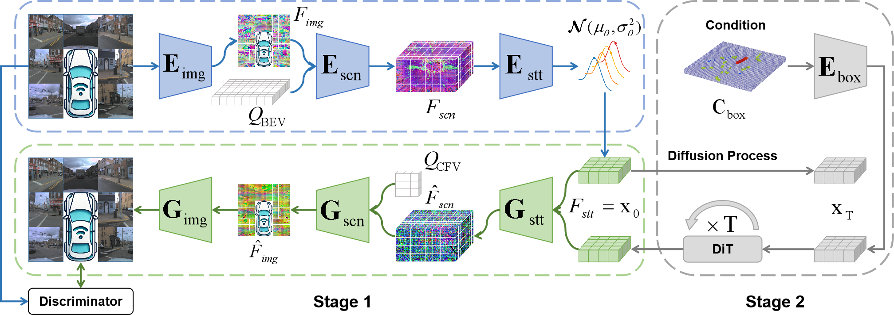

# BEV-VAE

## Abstract
Multi-view image generation in autonomous driving requires cross-view consistency for accurate 3D scene understanding. Current methods, mainly fine-tuning Stable Diffusion (SD), struggle with two issues: (1) treating multi-view generation as a set of 2D tasks, without explicitly modeling 3D structure, and (2) limited scalability, as larger datasets disrupt SD’s pre-trained 2D priors due to distribution shifts. To address these issues, BEV-VAE encodes multi-view images into a structured BEV latent space, capturing the 3D scene as a compact latent variable for reconstruction and generation. This is achieved through a two-stage process: In Stage 1, it encodes multi-view images into a compact BEV latent space and reconstructs them with spatial alignment. In Stage 2, a Diffusion Transformer (DiT) trained with classifier-free guidance (CFG) performs diffusion in the BEV latent space, modeling noise and generating latent variables via reverse denoising. The denoised latent variables are then decoded into multi-view images with improved cross-view alignment. Experiments demonstrate that BEV-VAE achieves competitive results on nuScenes and significantly better performance on the larger AV2 dataset, confirming its scalability in accordance with the scale law.

## Method

## Performence
:star2: <b>BEV-VAE w/ DiT</b> supports viewing reconstructed or generated driving scenes from different perspectives !
### Reconstruction on AV2
<video src="./assets/reconstruction_on_av2-val.mp4" controls autoplay loop muted width="600">
  Your browser does not support the video tag.
</video>

### Generation on AV2
<video src="./assets/generation_on_av2-val.mp4" controls autoplay loop muted width="600">
  Your browser does not support the video tag.
</video>

### Reconstruction on nuScenes
<video src="./assets/reconstruction_on_nuscenes-val.mp4" controls autoplay loop muted width="600">
  Your browser does not support the video tag.
</video>

### Generation on nuScenes
<video src="./assets/generation_on_nuscenes-val.mp4" controls autoplay loop muted width="600">
  Your browser does not support the video tag.
</video>