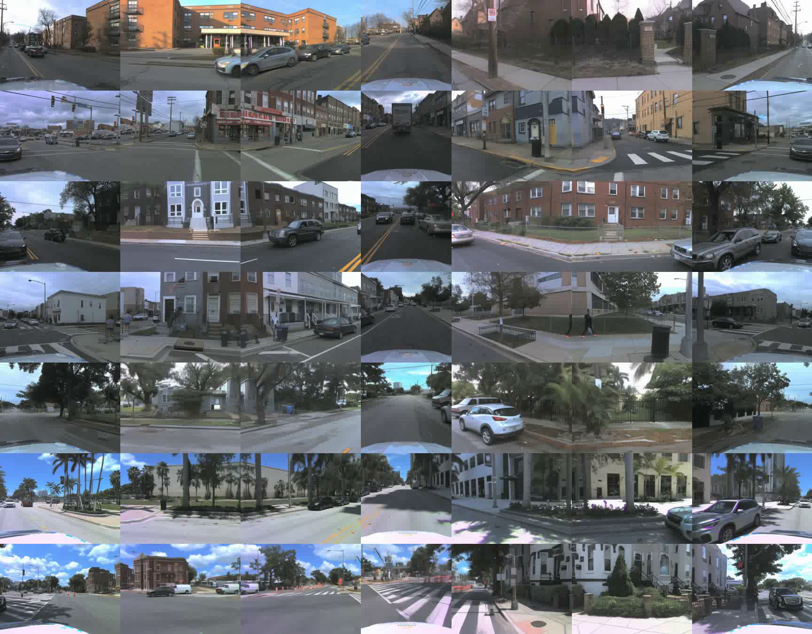
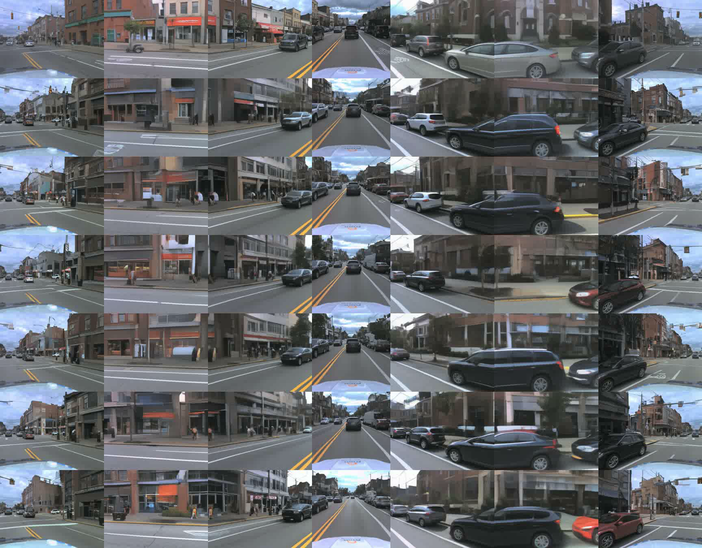
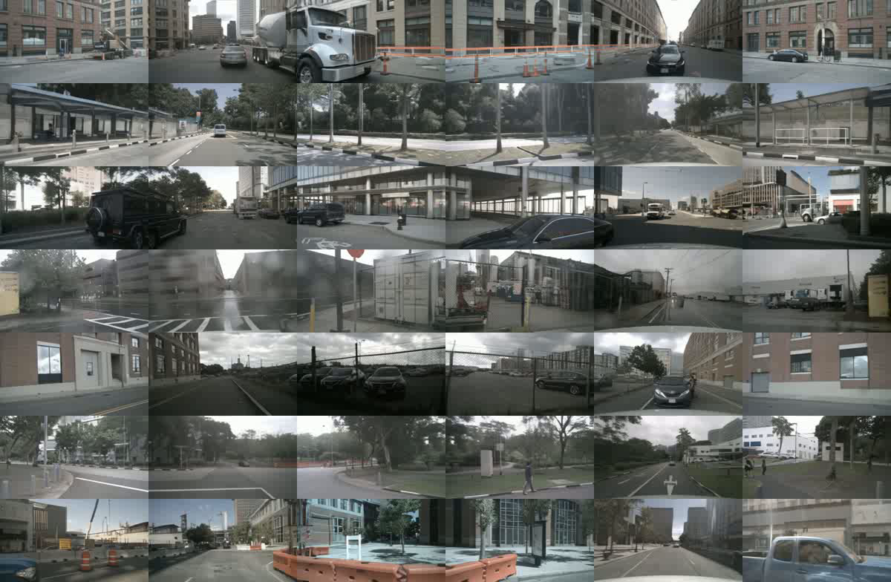
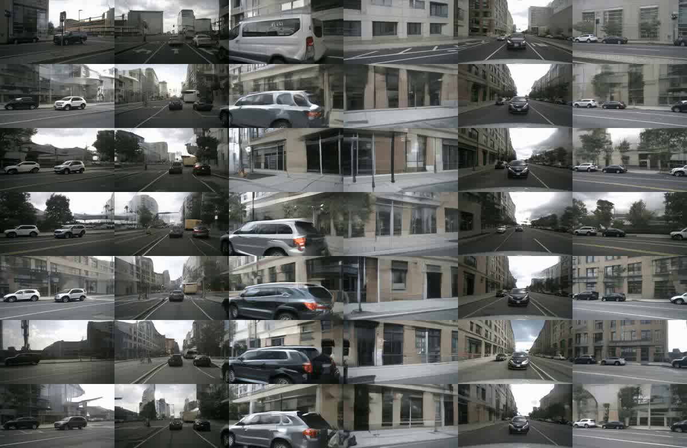
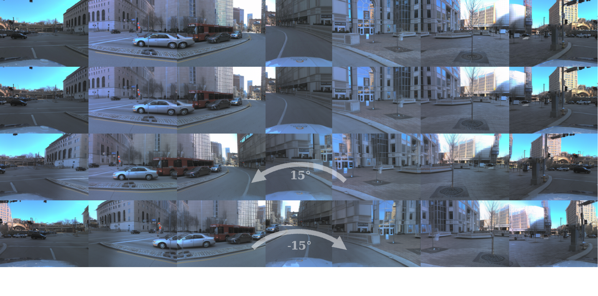
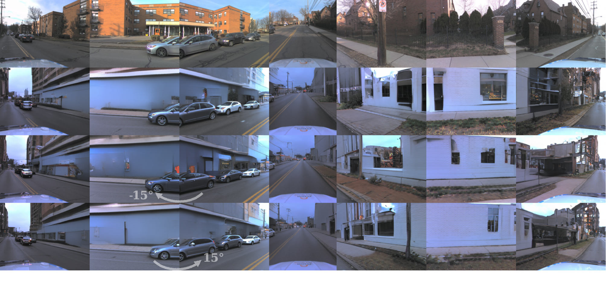
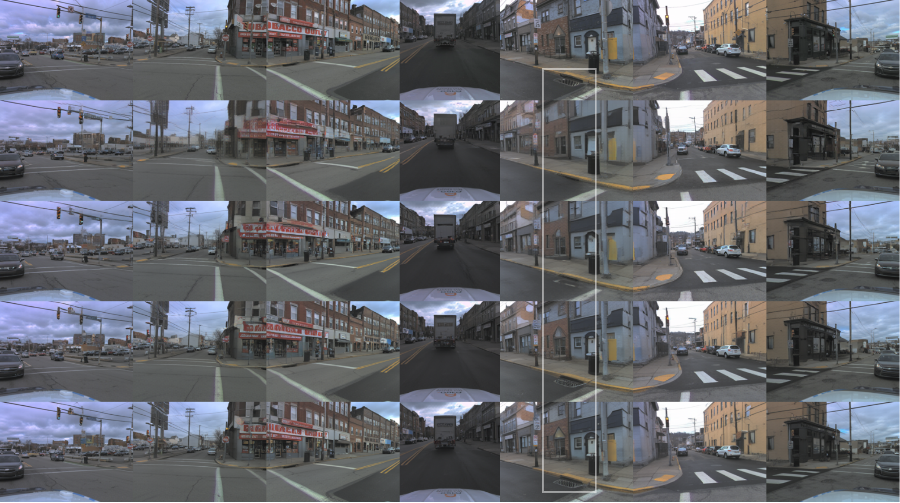

# BEV-VAE: Multi-view Image Generation with Spatial Consistency for Autonomous Driving
Zeming Chen
## Abstract

<b>TL; DR</b> BEV-VAE w/ DiT generates cross-view consistent multi-view images by modeling 3D scenes in BEV latent space, following the scale law.

Multi-view image generation in autonomous driving requires cross-view consistency for accurate 3D scene understanding. Current methods, mainly fine-tuning Stable Diffusion (SD), struggle with two issues: (1) treating multi-view generation as a set of 2D tasks, without explicitly modeling 3D structure, and (2) limited scalability, as larger datasets disrupt SD’s pre-trained 2D priors due to distribution shifts. To address these issues, BEV-VAE encodes multi-view images into a structured BEV latent space, capturing the 3D scene as a compact latent variable for reconstruction and generation. This is achieved through a two-stage process: In Stage 1, it encodes multi-view images into a compact BEV latent space and reconstructs them with spatial alignment. In Stage 2, a Diffusion Transformer (DiT) trained with classifier-free guidance (CFG) performs diffusion in the BEV latent space, modeling noise and generating latent variables via reverse denoising. The denoised latent variables are then decoded into multi-view images with improved cross-view alignment. Experiments demonstrate that BEV-VAE achieves competitive results on nuScenes and significantly better performance on the larger AV2 dataset, confirming its scalability in accordance with the scale law.

## Method

## Performence
:star2: <b>BEV-VAE w/ DiT</b> supports viewing reconstructed or generated driving scenes from different perspectives! 
### Reconstruction on AV2
The AV2 dataset consists of <b>7</b> cameras, with the front camera rotated by 90°. To simplify visualization, the top part of the front view is cropped.
You can <b>click on the image below</b> to watch the video showing the ego view rotated 15° to the left and right.

### Generation on AV2
<b>Row 1</b> shows reconstructed images from the validation set, <b>Row 2</b> shows images generated from the same 3D bounding boxes, and <b>each row after that</b> shows generated images with one specific vehicle removed. 
<b>Notice:</b> The same 3D bounding box may produce different objects across different generated images.
You can <b>click on the image below</b> to watch the video showing the ego view rotated 15° to the left and right.

### Reconstruction on nuScenes
The nuScenes dataset consists of <b>6</b> cameras, demonstrating that BEV-VAE can support autonomous driving data with different numbers of cameras — as long as the views together cover 360°.
You can <b>click on the image below</b> to watch the video showing the ego view rotated 15° to the left and right.

### Generation on nuScenes
<b>Row 1</b> shows reconstructed images from the validation set, <b>Row 2</b> shows images generated from the same 3D bounding boxes, and <b>each row after that</b> shows generated images with one specific vehicle removed. 
<b>Notice:</b> The same 3D bounding box may produce different objects across different generated images.
You can <b>click on the image below</b> to watch the video showing the ego view rotated 15° to the left and right.

### Rotating Camera Extrinsics to Render New Views on AV2
<b>Row 1</b> presents validation images, and <b>Row 2</b> shows reconstructions. <b>Rows 3 and 4</b> display reconstructed images with all cameras rotated 15° left and 15° right, respectively.

### Rotating the Orientation of a Specific Vehicle on AV2
<b>Row 1</b> presents validation images, and <b>Row 2</b> shows generated images. <b>Rows 3 and 4</b> depict the same vehicle rotated 15° clockwise and counterclockwise on the ego vehicle's horizontal plane.

###  Reconstruction across Different Latent Dimensions on AV2
<b>Row 1</b> shows images from the validation set, while <b>Rows 2-5</b> display BEV-VAE reconstructions with latent dimensions of 4, 8, 16, and 32. With higher latent dimensions, the reconstruction more accurately preserves fine details, such as the manhole covers in the white box.

## TODO
- [ ] releasing the paper
- [ ] inference code 
- [ ] pretrained weight for stage 1&2
- [ ] tutorial
- [ ] train code